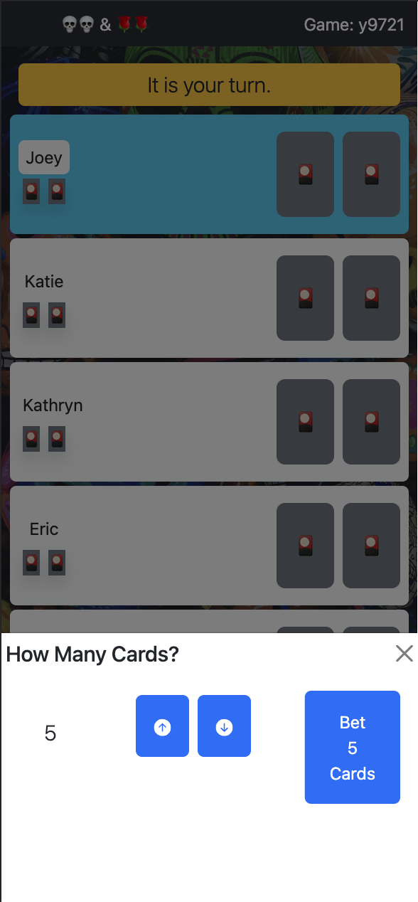

# Skulls and Roses, a Jackbox-style Multiplayer Card Game

Skulls and Roses is a simple card game based betting, bluffing, and deception. This project aims to recreate this card game using mobile devices instead of traditional playing cards. Players can gather in-person or virtually, join the game room, and play an entire game together. I borrowed the general idea from playing Jackbox party games such as Fibbage and Drawful. I aimed to create a similar user experience here.

## Game Rules

The basic rules of the game are as follows:
-Each player is dealt a hand of four cards: three "roses" and one "skull". Players can see their own hand.
-Each player lays one card of their choice face down.
-In order, each player may then either lay another facedown card OR place a bet
-When a player bets, they assert that they can reveal some number of roses
-Play moves to the next player who then may bet a higher number of roses, or fold
-This continues until all but one player have folded.
-This player must then flip over all of their own facedown cards, followed by other players cards of their choosing, one by one.
-If the player reveals the number of roses that they bet, they win the round.
-If at any point, this player flips over a skull, the round is over and they have lost the round.
-If a player loses a round, one of their cards is permanently removed from their hand, placing them at a disadvantage.
-A player wins the entire game by winning any two rounds.

## Usage

1. When players navigate to the application, they are greeted by a prompt to enter their name, followed by a prompt for them to either join an existing game (using a room code provided by another player), or create their own new game.

2. Players are the placed into a game lobby, which displays all of the players who have joined. If the user started their own new game, they should share their Game ID (displayed in the lobby) with their fellow players, who can then join using this Game ID.

3. Once all players have joined, they have the ability to change the order of play. By default, play proceeds in the same order in which players joined the lobby, however this is not always optimal. For example, if players are sitting around a table (IRL), they may choose to change the order to match their clockwise orientation around the table. To change the player order, the party leader can press the Re-Order Players button. The player to the left of the party leader is then prompted to press "Next", followed by the player to the left of them. This continues until each player has pressed next. The Order of Play should now reflect the clockwise orientation of the players physical locations. When all players have entered, and the order of play is correct, the party leader will press "Ready".

4. Next the players are placed into the game. A random player is select to begin play. The gameboard shows each player, which cards they have played and how many cards they have in their hand. A highlighted player denotes that it is their turn. A player can view their curret hand by selecting the Show Hand button at the bottom of the screen. When it is their turn, they are able to play a card from their hand by selecting the card. Players are able to use the Make a Bet button on their turn once each player has laid at least one card.

5. Once betting begins, players are able to Raise or Fold. This continues until all but one player has folded at which point the highest better can begin flipping cards.

6. The highest better is prompted to first flip their own cards. Once they have done this, the can nominate another player on the board to flip their next card.

7. This continues until either the required number of roses have been exposed, or the better flips a skull, resulting in the better either winning or losing that round. If the better won, they recieve a point. If not, they will have one of their cards removed from their hand. The game will then reset and proceed to the next round.

8. Play continues until one player wins two rounds and the game is over!

## Installation

1. Clone the repository
   `git clone https://github.com/your-username/your-repo-name.git`

2. Install dependencies
   `cd js-skulls`
   `npm install`

3. Start the server
   `npm run server`

4. Start the client
   `npm run client`

5. Open the app in your browser at the following address: http://localhost:3000/

Note: Make sure to have Node.js and npm installed on your machine before running these commands. If you don't have them installed, you can download them from the official Node.js website: https://nodejs.org/en/download/
